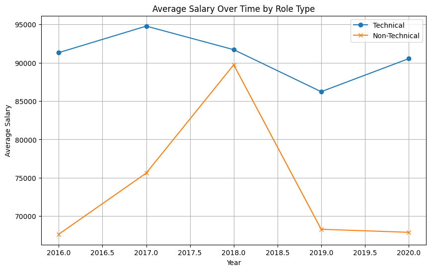

I choose the data exercise since i am most familiar with python and data is something i enjoy

To run this project kindly run  

```pip install -r requirements.txt ```
in your virtual environemnt . Then run the noteobook!

To update the exchange rates please insert your app id from https://openexchangerates.org/account/app-ids  ( it is free)
and run the ``` get_rates.py``` script
alternatively you may replace the exchange rate information in ```data/currency_conversion_rates.csv```

